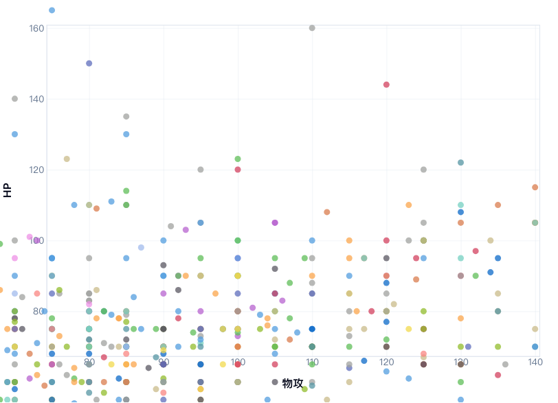

# 現有功能缺漏盤點

日期：2026-09-26。檢查已推送的程式基準 `bdce084`；後續 `f2cb3b0` 為四份根文件同步，沒有更改功能。

後續 #21～#25 已分項實作；修正與驗收入口見 [ROADMAP](../../ROADMAP.md#已交付功能盤點後的補強)。以下保留當時基準的原始發現，並非目前仍待修正的清單。

## 驗證範圍與結果

- 在 `/private/tmp` 的獨立程式快照建置並啟動正式服務，使用 Node.js 24.21.0、既有依賴及完整 CSV，避免共用開發服務的 `.next`。首次沙盒建置無法連線 Google Fonts，允許既有字型下載後正式建置成功。
- `PLAYWRIGHT_BASE_URL=http://127.0.0.1:3040 yarn test:e2e --workers=1`：9 個檔案、237 項測試全部通過，約 3.9 分鐘。Chromium／Firefox／WebKit 各 79 項；本次沒有跳過或修改測試。
- 另以獨立瀏覽器情境檢查既有測試未覆蓋的同路由導覽、同頁資料更新、放大畫面、控制項名稱與手機 touch 操作。
- 既有 237 項通過不代表下列未覆蓋情境沒有缺陷。此次只記錄並建立追蹤，沒有修改功能程式。

## 已確認的功能問題

| 優先級 | 追蹤                                                                                         | 重現與實際結果                                                                                                                         | 預期                                                                   |
| ------ | -------------------------------------------------------------------------------------------- | -------------------------------------------------------------------------------------------------------------------------------------- | ---------------------------------------------------------------------- |
| P2     | [#21 圖鑑導覽批次未重置](https://github.com/krok1029/Pokemon-D3-Effect-Practice/issues/21)   | 直接開 `/pokemon?page=3`，點主要導覽「寶可夢」後，網址回到 `/pokemon`，卻仍為第 49–72 筆、首筆 Alolan Vulpix；刷新後才回到 Bulbasaur。 | 明確導覽與網址所代表的批次一致，同時保留捲動更新網址和詳細頁返回定位。 |
| P2     | [#22 傳說切換清除分析條件](https://github.com/krok1029/Pokemon-D3-Effect-Practice/issues/22) | X 選特攻、Y 選速度、關閉火屬性後，切換「排除傳說」會回到物攻／HP，火屬性也重新開啟。                                                   | 同頁只更換樣本資料，保留仍有效的能力軸與主屬性條件。                   |
| P2     | [#23 放大後資料點遮住軸](https://github.com/krok1029/Pokemon-D3-Effect-Practice/issues/23)   | 在 `/chart?excludeLegendaries=true` 預設物攻／HP 連按放大六次，150 個資料點落在繪圖區外但 SVG 內，覆蓋刻度與標題。                     | 點圖層裁切於繪圖區，座標軸與互動保持正確。                             |

程式位置：`PokemonList.tsx` 的 Feed key 與 `PokemonFeed.tsx` 的首次 scope 初始化；`StatScatterMatrix.tsx` 依陣列引用重設狀態的 effects，以及未裁切的點圖層。

以下為 #23 的正式頁面重現畫面，資料點可見於 Y 軸刻度與「物攻」標題區域：

## 應補的操作與回歸保障

- [#24 手機、鍵盤與控制項標籤](https://github.com/krok1029/Pokemon-D3-Effect-Practice/issues/24)：手機 touch 拖曳未產生選取，SVG 沒有可聚焦資料點或替代選取入口，純鍵盤只能操作滑鼠事先產生的結果連結。「比較能力」下拉選單也缺少可存取名稱。手機／鍵盤的完整選取流程是後續增強，並非 #20 原驗收宣告失敗。
- [#25 隔離 E2E 與 CI 自動回歸](https://github.com/krok1029/Pokemon-D3-Effect-Practice/issues/25)：repository 尚無 CI 定義；預設 Playwright 會啟動或重用開發服務，與歷史及本次成功驗收的隔離正式環境不同。需提供可重現命令、建置／port／CSV 隔離與失敗 trace，並補六項平均值、雷達顯示及依屬性平均圖切換數值／排序的 UI 回歸。沒有證據表示目前預設命令在所有環境都會失敗。

## 已知限制與可選新功能

- 1,032 筆型態中 1,025 筆已有圖片，剩 7 筆為官方來源未提供可確認專圖的型態；已有明確降級，不是配圖邏輯錯誤。見 [官方補圖驗收](official-image-download.md)。
- 2～4 隻型態比較、中文搜尋、世代／基本型態篩選均是新功能候選，沒有納入本次實作。
- 散佈圖跨頁框選／縮放保存屬原規格外功能；#22 是同頁切換條件，不應混為同一限制。

建議先處理 #21～#23，接著補 #24／#25，再投入比較功能。#13～#20 保留原交付歷史，新增問題由獨立票追蹤。
