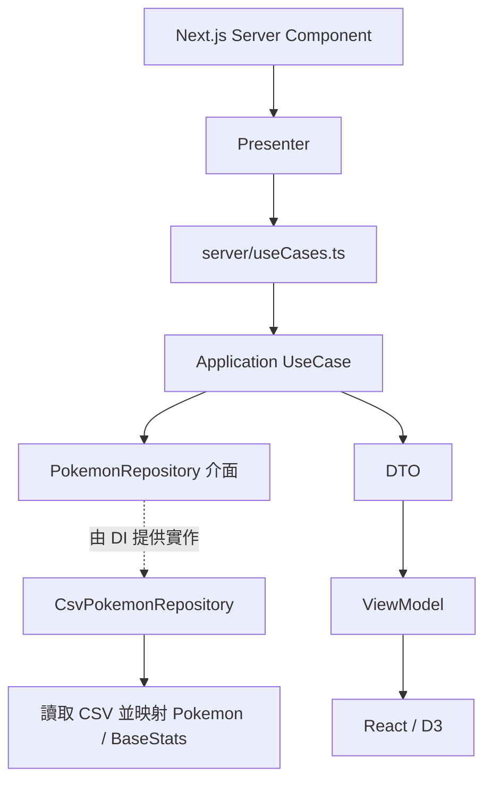

# 開發指南

這份指南說明現有程式如何運作，以及改動時應追蹤的邊界。用途、啟動指令與資料總覽見 [README](README.md)，未實作的建議集中於 [ROADMAP](ROADMAP.md)。以下依 2026-09-19 的本機程式碼整理，未重新執行應用或測試。

## 1. 從哪裡開始讀

| 想了解的部分 | 入口 |
| --- | --- |
| 圖表如何組成 | `src/app/(routes)/chart/ChartPage.tsx` |
| 圖表資料如何取得 | `src/app/(routes)/chart/presenter.ts` |
| 散佈圖互動 | `src/app/(routes)/chart/components/StatScatterMatrix.tsx` |
| 圖鑑搜尋與篩選 | `src/app/pokemon/components/PokemonList.tsx` |
| 詳細頁與相剋環形圖 | `src/app/pokemon/[id]/page.tsx` |
| 相剋算法與詳細頁資料格式 | `src/app/pokemon/view-models/pokemonDetailViewModel.ts` |
| CSV 如何轉成領域物件 | `src/infra/csv/CsvPokemonMapper.ts` |
| 服務如何建立 | `src/server/container.ts` |

## 2. 查詢與呈現流程

統計頁使用 `Promise.all` 載入全體平均、依屬性平均與個別能力三組資料。它們共用同一個 Repository 實例，但快取只保存完成後的資料，尚未共用讀取中的 Promise；冷啟動的並行請求可能重複讀檔。

| UseCase | 輸出 |
| --- | --- |
| `GetAveragePokemonStatsUseCase` | 筆數及六項能力平均，四捨五入到小數一位 |
| `GetAveragePokemonStatsByTypeUseCase` | 各屬性的樣本數及六項平均；雙屬性同時計入兩組 |
| `GetPokemonBaseStatsUseCase` | 每筆資料的編號、名稱、屬性、傳說狀態與原始能力值 |

三個 UseCase 都支援 `excludeLegendaries`。Repository 的查詢介面目前只有是否包含傳說的條件，沒有單筆、名稱、型態或分頁查詢。

## 3. Domain 與資料語意

- `Pokemon` 驗證編號為正整數、名稱與主屬性非空；副屬性可為 `null`。
- `BaseStats.create` 驗證原始能力為 1～255 的整數。`zero`、`add`、`div` 提供加總與平均的中間結果，這些結果不套用相同的原始能力限制。
- `StatsAverager` 對六項能力做算術平均，空集合回傳全零結果。
- CSV 的 `Number` 是圖鑑編號，不是每筆型態資料的唯一鍵。現有 Entity 沒有獨立型態識別欄位。
- 平均值以 CSV 每列為一筆，不先依編號去重；是否要提供「只看基本型態」目前仍是產品待辦。

Mapper 使用 `Number`、`Name`、`Type 1`、`Type 2`、`Legendary`、`HP`、`Att`、`Def`、`Spa`、`Spd`、`Spe`。它不讀取 CSV 的能力總和或相剋欄位：總和由 ViewModel 計算，相剋使用程式內的矩陣。

## 4. App 層與互動狀態

頁面通常由 Server Component 呼叫 Presenter，再將可序列化的 ViewModel 傳給 Client Component。資料讀取使用 Node.js 檔案系統，現有架構需要可讀取 `data` 與 `public/img` 的伺服器環境；目前沒有 API Route 或獨立後端服務。

| 互動 | 狀態位置與更新方式 |
| --- | --- |
| 排除傳說 | URL 的 `excludeLegendaries`，透過 `router.replace` 重新載入伺服器資料；接受 `1`、`true`、`yes` |
| 圖鑑關鍵字、屬性、只看傳說 | Client Component 的 React state，在已載入的完整列表中篩選；重新整理不保留 |
| 直條圖的比較能力 | React state，依選取能力由高到低排序 |
| 散佈圖的 X/Y 軸、屬性圖例與框選 | React state；圖例篩選只依主屬性 |
| 散佈圖縮放 | D3 zoom 與 ref；按鈕縮放、中鍵平移，框選使用 D3 brush |

`StatScatterMatrix` 名稱保留自先前設計，現況是可切換 X/Y 軸的單一散佈圖，並非同時呈現所有能力配對的矩陣。

雷達圖、直條圖和散佈圖在 `useEffect` 中由 D3 操作 SVG；React 管理容器、控制項與資料。詳細頁的雙環圖使用 `d3-shape` 計算弧線，由 React 產生 SVG，不需在瀏覽器執行 D3 DOM 操作。

能力條的長度依該能力在整份載入資料中的最大值正規化，不是固定除以 255；不同能力的條長不能直接當成相同刻度比較。

## 5. 圖鑑與屬性相剋

`loadPokemonDetailPageViewModel` 會取得所有能力資料，為每筆建立圖片路徑、能力條、總和與兩組相剋結果。列表與詳細頁共用這份完整 ViewModel；詳細頁與 metadata 目前分別載入後再以編號找第一筆，沒有專用的單筆查詢。

目前相剋計算：

- 防禦：對每種攻擊屬性，將它對寶可夢主、副屬性的倍率相乘。
- 攻擊：嘗試從自身主、副屬性的攻擊中取較高倍率，目標只有單一屬性，未計入其他戰鬥條件。
- 已知問題：攻擊端 `reduce` 初值是 `1`，結果永遠不低於 `1`，因此抗性與免疫會被顯示成等倍。修正前不可將此區當作正確的完整對戰判斷。

圖片查找透過掃描 `public/img` 建立編號到檔名的快取。目前只解析檔名前三位數，且同編號只保留第一個找到的檔案；它無法可靠區分型態，四位數編號也會被錯誤辨識。缺檔或讀取失敗時回傳 `null`，由頁面顯示佔位內容。

## 6. 設定、快取與 DI

`ConfigProvider` 在容器初始化時選擇 CSV 路徑，`CsvPokemonRepository` 在第一次查詢時讀檔。設定優先順序與啟動範例見 [README](README.md)。CSV 和圖片索引都只有記憶體快取，沒有檔案監聽或手動失效入口。

`src/di/tokens.ts` 定義 Symbol；`src/server/container.ts` 註冊設定值、Repository 實例、StatsAverager singleton 及 UseCase factory。UseCase 由 factory 建立，並非全部都是 singleton。頁面透過 `server/useCases.ts` 取得服務。

新增 UseCase 時，依序處理 Domain 介面、UseCase / DTO、token / factory / container、Presenter / ViewModel 與頁面。只有新增依賴才需要新增 token，沿用既有依賴時不必機械式增加註冊。

## 7. 分層原則與現況落差

目標是讓 Application / Domain 不依賴 Next.js、React 或 I/O；Infra 實作外部存取，App 負責呈現，Server 負責組裝。

目前仍有兩個例外，後續維護時需知悉：

1. 相剋矩陣及算法在 App 的 ViewModel，尚未移到 Domain。
2. `core/shared/utils.ts` 的 `cn` 依賴 clsx 與 tailwind-merge，實際上是 UI 工具，不能將整個 `core` 描述成完全獨立於 UI。

另外，圖鑑 ViewModel 直接引用 chart 目錄內的能力標籤、屬性翻譯與配色。需要重用或調整時，先確認兩個頁面的影響，再考慮抽到共用呈現模組。

## 8. 現有驗證工具

Vitest 設定使用 jsdom、Testing Library 與 `tests/setup.ts`。測試分布在 `tests/domain`、`tests/application`、`tests/infra`、`tests/server`、`tests/app/pokemon`；共用資料在 `tests/factories`、`tests/stubs`。目前沒有獨立的 `tests/integration` 目錄。

Playwright 設定使用 Chromium、Firefox、WebKit，預設可啟動 `yarn dev`，但 `tests/e2e` 目錄與案例尚未建立。設定存在不等於流程已被驗證。

本次僅更新文件，保留測試檔、測試設定、fixture 與套件指令原樣；沒有重跑測試或取得新的通過／覆蓋率結果。後續工作建議與手動驗收條件見 [ROADMAP](ROADMAP.md)。
