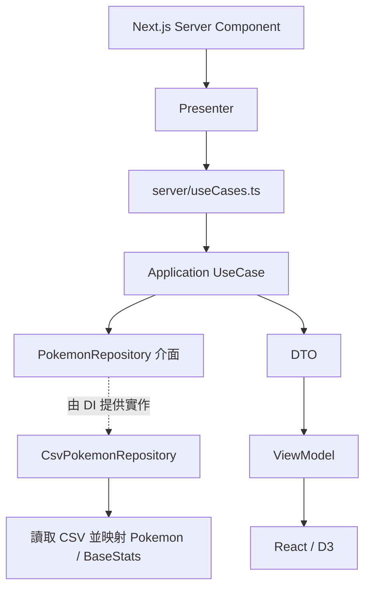

# 開發指南

這份指南說明現有程式如何運作，以及改動時應追蹤的邊界。用途、啟動指令與資料總覽見 [README](README.md)，工作狀態集中於 [ROADMAP](ROADMAP.md)。以下隨 2026-09-26 的 #21～#25 實作更新。

## 1. 從哪裡開始讀

| 想了解的部分             | 入口                                                      |
| ------------------------ | --------------------------------------------------------- |
| 圖表如何組成             | `src/app/(routes)/chart/ChartPage.tsx`                    |
| 圖表資料如何取得         | `src/app/(routes)/chart/presenter.ts`                     |
| 散佈圖互動               | `src/app/(routes)/chart/components/StatScatterMatrix.tsx` |
| 圖鑑搜尋與篩選           | `src/app/pokemon/components/PokemonList.tsx`              |
| 詳細頁與攻擊方向對照     | `src/app/pokemon/[id]/page.tsx`                           |
| 相剋算法與詳細頁資料格式 | `src/app/pokemon/view-models/pokemonDetailViewModel.ts`   |
| CSV 如何轉成領域物件     | `src/infra/csv/CsvPokemonMapper.ts`                       |
| 服務如何建立             | `src/server/container.ts`                                 |

## 2. 查詢與呈現流程

統計頁使用 `Promise.all` 載入全體平均、依屬性平均與個別能力三組資料。它們共用同一個 Repository 實例，但快取只保存完成後的資料，尚未共用讀取中的 Promise；冷啟動的並行請求可能重複讀檔。

| UseCase                               | 輸出                                             |
| ------------------------------------- | ------------------------------------------------ |
| `GetAveragePokemonStatsUseCase`       | 筆數及六項能力平均，四捨五入到小數一位           |
| `GetAveragePokemonStatsByTypeUseCase` | 各屬性的樣本數及六項平均；雙屬性同時計入兩組     |
| `GetPokemonBaseStatsUseCase`          | 每筆資料的編號、名稱、屬性、傳說狀態與原始能力值 |

三個 UseCase 都支援 `excludeLegendaries`。Repository 查詢可追加 `id` 與 `formId`；`GetPokemonBaseStatsUseCase.executeForForm` 取得指定型態或舊網址的預設型態。圖鑑的篩選與每批 24 筆切片由 App 列表 ViewModel 處理，UseCase 與 Repository 仍維持既有 DTO／查詢契約。

## 3. Domain 與資料語意

- `Pokemon` 驗證編號為正整數、名稱與主屬性非空；副屬性可為 `null`。
- `BaseStats.create` 驗證原始能力為 1～255 的整數。`zero`、`add`、`div` 提供加總與平均的中間結果，這些結果不套用相同的原始能力限制。
- `StatsAverager` 對六項能力做算術平均，空集合回傳全零結果。
- CSV 的 `Number` 是圖鑑編號，與 `formId` 共同構成型態身份。`formId` 由英文名稱正規化為 slug，不使用 CSV 列位置；同編號下的身份碰撞會在 Repository 載入時報錯。
- 平均值以 CSV 每列為一筆，不先依編號去重；是否要提供「只看基本型態」目前仍是產品待辦。

Mapper 使用 `Number`、`Name`、`Type 1`、`Type 2`、`Legendary`、`HP`、`Att`、`Def`、`Spa`、`Spd`、`Spe`。它不讀取 CSV 的能力總和或相剋欄位：總和由 ViewModel 計算，相剋使用程式內的矩陣。

整數欄位先驗證完整十進位格式，再以 `Number.isSafeInteger` 檢查精度；接受前後空白、前置零與正負號，小數字串（含 `.0`）、科學記號、數字混雜文字及不安全整數均報錯。錯誤中的 Row 是不含 CSV 標題列的資料筆次；合法整數的正值／能力範圍仍交由 Domain 驗證。

## 4. App 層與互動狀態

頁面通常由 Server Component 呼叫 Presenter，再將可序列化的 ViewModel 傳給 Client Component。資料讀取使用 Node.js 檔案系統，現有架構需要可讀取 `data` 與 `public/img` 的伺服器環境；`GET /api/pokemon` 提供無限捲動的後續批次，與頁面共用 Presenter；沒有獨立後端服務。

首頁及圖鑑明確設定動態呈現，避免正式建置把 CSV 資料固定在建置時；切換 `POKEMON_DATA_PATH` 後重新啟動服務即可套用同一份資料。篩選控制在瀏覽器完成初始化前保持停用，避免較慢載入時輸入遺失。

| 互動                            | 狀態位置與更新方式                                                                                        |
| ------------------------------- | --------------------------------------------------------------------------------------------------------- |
| 排除傳說                        | URL 的 `excludeLegendaries`，透過 `router.replace` 重新載入伺服器資料；接受 `1`、`true`、`yes`            |
| 圖鑑關鍵字、屬性、只看傳說      | URL 的 `q`、`type`、`legendary=1`，由伺服器先篩選完整資料再回傳當批卡片；刷新、分享與上一頁／下一頁會還原 |
| 直條圖的比較能力                | React state，依選取能力由高到低排序                                                                       |
| 散佈圖的 X/Y 軸、屬性圖例與框選 | React state；圖例篩選只依主屬性                                                                           |
| 散佈圖縮放                      | D3 zoom 與 ref；按鈕縮放、中鍵平移，框選使用 D3 brush                                                     |

`StatScatterMatrix` 名稱保留自先前設計，現況是可切換 X/Y 軸的單一散佈圖，並非同時呈現所有能力配對的矩陣。

框選身份與結果 key 使用圖鑑編號加 `formId`。Chart ViewModel 提供 `/pokemon/[id]?form=...` 的 `detailHref`，結果名稱是可鍵盤開啟、複製與分享的連結；停用預取，避免大量選取時預先載入所有詳細頁。圖例明示只依主屬性篩選，與圖鑑比對主副屬性的語意不同。同頁傳說切換保留能力軸及關閉的主屬性偏好，僅移除不再符合資料與篩選的選取。

`PokemonChartSelection` 提供名稱／編號搜尋與原生選取按鈕，供鍵盤及觸控操作；最多呈現 12 筆匹配型態，沿用散佈圖的資料條件與同一份選取狀態。散佈圖資料點使用獨立 `clipPath`，縮放與平移不覆蓋座標軸。跨頁選取／縮放狀態不持久化，手機拖曳框選尚未實作。

雷達圖、直條圖和散佈圖在 `useEffect` 中由 D3 操作 SVG；React 管理容器、控制項與資料。詳細頁以 React 呈現攻擊／被攻擊雙欄對照：左欄由寶可夢圖片指向對手屬性，右欄由招式屬性指向寶可夢圖片。兩邊直接顯示全部 18 種屬性與倍率，手機版上下排列，不需展開或在卡片內捲動。

散佈圖選取樣式由獨立 effect 更新現有資料點，不重建進行中的 zoom／brush。雷達與平均直條圖直接使用 SVG 的主題 CSS 變數，讓瀏覽器解析 OKLCH 並即時跟隨明暗切換，不再透過 `d3.color` 解析主題色。

能力條的長度依該能力在整份載入資料中的最大值正規化，不是固定除以 255；不同能力的條長不能直接當成相同刻度比較。

## 5. 圖鑑與屬性相剋

列表的 `loadPokemonListPage` 先篩選、排序、切出 24 筆，再透過 `pokemonCardViewModel` 組裝卡片；不包含攻擊／防禦相剋。總數、屬性選項和能力最大值仍以完整資料計算。詳細頁及 metadata 共用 `loadPokemonFormViewModel`，只為目標型態組裝詳細相剋，同時保留整份資料的能力最大值刻度。

圖鑑 ViewModel 與圖表搜尋元件共用 `pokemon/lib/pokemonSearch.ts`：`#` 前綴或多位數前置零表示精確編號，一般數字保留部分比對；名稱比對忽略大小寫、空白、句點與直／彎單引號。URL 保留原始輸入，搜尋正規化不改變 `formId` 或型態名稱。

`PokemonFeed` 在距離底部 600px 內請求下一批，保留可用鍵盤操作的「載入更多」、前一批與錯誤重試按鈕。切換條件會取消舊請求並重設批次；搜尋請求延後 150ms，控制項和網址立即更新。主要導覽帶入新的伺服器初始資料時會重建列表；捲動只更新瀏覽器歷史網址時則保留已累積批次。

每次列表請求（含讀取回應內容）有 15 秒期限。逾時後保留既有批次、停止自動追加並提示重新載入同一批；切換條件或卸載造成的取消不顯示逾時，舊回應不能覆寫新列表。

`PokemonVirtualGrid` 在累積超過 48 筆後，以 TanStack Virtual 量測每列高度，只渲染視窗及前後各兩列；保留焦點所在列與相鄰列，支援鍵盤繼續前進。改變視窗欄數、切換虛擬版面或載入前段時，以卡片錨點維持位置。圖鑑掛載期間停用瀏覽器自動捲動錨定，避免頁尾追隨新增資料。

`PokemonCardImage` 保留 96×96 空間，起始前三張優先，其餘圖片靠近視窗 240px 內才請求；有載入佔位、淡入、缺圖與失敗提示。虛擬列表捲動停止 160ms 後再請求新進入畫面的圖片；同一張掛載中的卡片不會因捲動而移除已請求的圖片。

型態網址例如 `/pokemon/6?form=mega-charizard-x`。名稱相同且 CSV 重排時網址不變；名稱若改名則需另行處理舊 slug 的轉址。舊 `/pokemon/6` 依同編號中最短名稱、再按名稱排序選定預設型態，預設 CSV 會得到 Charizard；這是穩定的退回策略，不宣稱能辨識任意來源的基本型態。非法編號、格式錯誤或不存在的明示型態顯示找不到資料。

圖鑑詳細連結附帶受限制的 `returnTo`，保留篩選條件、`page` 批次及原卡片錨點；詳細頁的返回入口只接受本網站圖鑑路徑與已知參數。直接開啟詳細頁時返回圖鑑第一批。批次超過總數會回到最後一批，非正整數回到第一批；空結果亦回到第一批。

捲到不同批次時以 `replaceState` 記錄目前批次，避免每次載入都增加歷史紀錄。開啟詳細頁前固定來源錨點，阻止尚未結束的捲動事件覆寫它；sessionStorage 額外保留卡片在視窗中的高度。分享或刷新後即使沒有這份暫存，仍可依網址的批次與錨點回到原卡片。深層返回只載入該批，較早的資料可用「載入前 24 筆」取得。

目前相剋計算：

- 防禦：對每種攻擊屬性，將它對寶可夢主、副屬性的倍率相乘。
- 攻擊：從自身主、副屬性的攻擊中取較高倍率，保留 0× 免疫與 0.5× 抗性；目標只有單一屬性，不含本系加成、特性、道具及實際招式配置。

圖片查找透過掃描 `public/img` 建立編號到檔名集合的快取，完整解析三位及四位數編號、`_` 或 `-` 分隔符及支援的副檔名。`src/app/pokemon/lib/pokemonFormImages.json` 以 `編號:formId` 明確對應完整檔名；列表與詳細頁共用卡片 ViewModel 的選圖規則，只使用對照中且實際存在的圖檔，不依賴列舉順序。

未對照、缺檔或目錄讀取失敗時回傳 `null`，由頁面顯示「無圖片／尚無此型態對應圖檔」；圖片 HTTP 請求失敗時顯示「圖片暫無法載入」。補入 129 張官方圖後，目前 1,025 列有圖；Ash-Greninja 及 Pumpkaboo／Gourgeist 各 Small、Large、Super 尺寸共 7 列保留佔位。新增圖片須先確認實際型態、更新對照並重啟服務；四位數圖片支援不代表 CSV 已新增相應資料。初始資源盤點與維護方式見 [#16 驗收紀錄](docs/verification/image-form-mapping.md)；後續官方補圖的來源、尺寸、校驗及剩餘缺圖原因見 [圖片來源清單](data/pokemon-image-sources.json)，測試結果見 [官方補圖驗收](docs/verification/official-image-download.md)。

## 6. 設定、快取與 DI

`ConfigProvider` 在容器初始化時選擇 CSV 路徑，`CsvPokemonRepository` 在第一次查詢時讀檔。設定優先順序與啟動範例見 [README](README.md)。CSV 和圖片索引都只有記憶體快取，沒有檔案監聽或手動失效入口。

`src/di/tokens.ts` 定義 Symbol；`src/server/container.ts` 註冊設定值、Repository 實例、StatsAverager singleton 及 UseCase factory。UseCase 由 factory 建立，並非全部都是 singleton。頁面透過 `server/useCases.ts` 取得服務。

新增 UseCase 時，依序處理 Domain 介面、UseCase / DTO、token / factory / container、Presenter / ViewModel 與頁面。只有新增依賴才需要新增 token，沿用既有依賴時不必機械式增加註冊。

## 7. 分層原則與現況落差

目標是讓 Application / Domain 不依賴 Next.js、React 或 I/O；Infra 實作外部存取，App 負責呈現，Server 負責組裝。

目前仍有兩個例外，後續維護時需知悉：

1. 相剋矩陣及算法在 App 的 ViewModel，尚未移到 Domain。
2. `core/shared/utils.ts` 的 `cn` 依賴 clsx 與 tailwind-merge，實際上是 UI 工具，不能將整個 `core` 描述成完全獨立於 UI。

另外，圖鑑 ViewModel 直接引用 chart 目錄內的能力標籤、屬性翻譯與配色。需要重用或調整時，先確認兩個頁面的影響，再考慮抽到共用呈現模組。

## 8. 現有驗證工具

Vitest 設定使用 jsdom、Testing Library 與 `tests/setup.ts`。測試分布在 `tests/domain`、`tests/application`、`tests/infra`、`tests/server`、`tests/app/pokemon`；共用資料在 `tests/factories`、`tests/stubs`。目前沒有獨立的 `tests/integration` 目錄。

Playwright 使用 Chromium、Firefox、WebKit，透過 `yarn test:e2e` 複製當前已追蹤與未被忽略的工作檔至暫存目錄，共用 node_modules，再建置正式版。runner 分別啟動完整 CSV 與平均圖專用 fixture 服務，自動分配連接埠並確認資料筆數，預設一個 worker；結束後關閉自己建立的程序並移除 snapshot。根 `.next` 與既有開發服務不受影響。

`tests/e2e` 驗證公開頁面與網址；Vitest 排除這些瀏覽器案例。`--suite=catalog|averages` 可只驗證一組資料，其他參數傳給 Playwright。自訂 `PLAYWRIGHT_BASE_URL` 必須明確指定 suite，且自行確保 CSV 相符及重新啟動服務。`test-results/regression-*` 保留各階段 log、HTML 報告、失敗 screenshot／trace；產生目錄不納入 ESLint。GitHub Actions 依 `.nvmrc` 及鎖定的 Yarn 執行不可變安裝、靜態與單元檢查、相同正式版回歸，失敗時上傳 artifacts。

使用者已授權需求確定後調整對應測試。第一批的環境、指令及驗收結果見 [驗收紀錄](docs/verification/roadmap-batch-1.md)；後續工作見 [ROADMAP](ROADMAP.md)。
